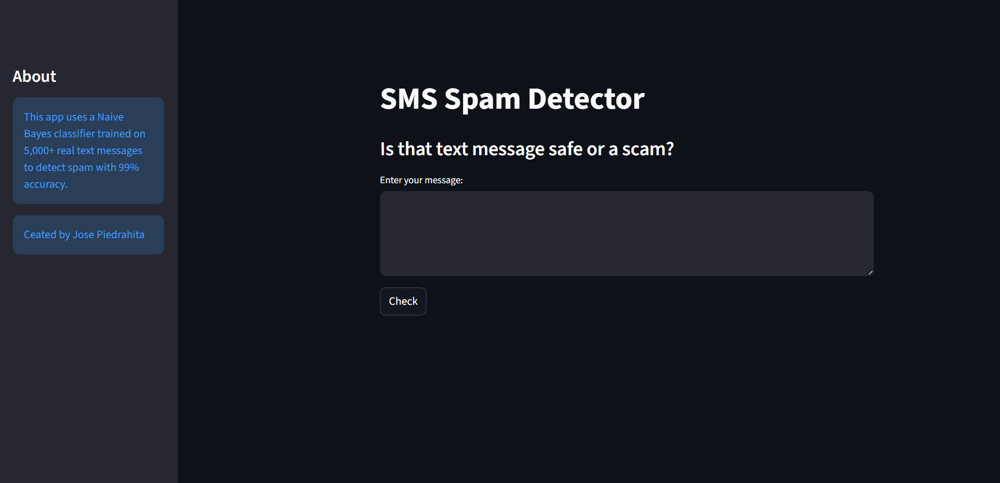

# SMS Spam Detector App

## Project Overview
This is a machine learning web application that detects if a text message is **Spam** or **Safe (Ham)**. It uses Natural Language Processing (NLP) to analyze the text and a Naive Bayes classifier to make predictions.

## Demo
 

## Tech Stack
- **Python**
- **Scikit-Learn** (Multinomial Naive Bayes)
- **Streamlit** (Web Interface)
- **Pandas** (Data Processing)

## How to Run locally
1. Clone the repository.
2. Install dependencies:
   ```bash
   pip install -r requirements.txt